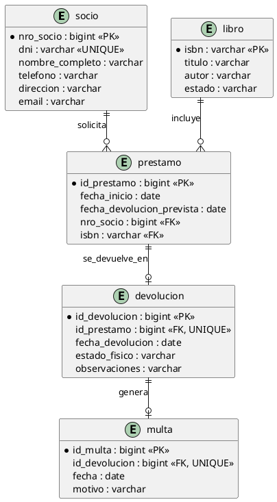

# Modelo de Datos — Biblioteca (MER y MR)

Este repo incluye archivos que **VS Code** puede leer y previsualizar fácilmente:
- `biblioteca.dbml` → formato **DBML** (extensión *DBML Preview* o *dbdiagram*).
- `modelo.puml` → **PlantUML** (extensión *PlantUML*).
- `migration.sql` → **DDL PostgreSQL/Supabase** (para ejecutar en SQL Editor).
- Este `README.md` con snippets de **Mermaid** y **PlantUML**.

---

## 📐 MER (Mermaid ER Diagram)

> Abrí este archivo en VS Code y activá la vista previa Markdown (`Ctrl+Shift+V`).

```mermaid
erDiagram
    SOCIO {
        nro_socio
        dni
        nombre_completo
        telefono
        direccion
        email
    }

    LIBRO {
        isbn
        titulo
        autor
        estado
    }

    PRESTAMO {
        id_prestamo
        fecha_inicio
        fecha_devolucion_prevista
        nro_socio
        isbn
    }

    DEVOLUCION {
        id_devolucion
        id_prestamo
        fecha_devolucion
        estado_fisico
        observaciones
    }

    MULTA {
        id_multa
        id_devolucion
        fecha
        motivo
        monto
    }

    SOCIO ||--o{ PRESTAMO : solicita
    LIBRO ||--o{ PRESTAMO : se_presta_en
    PRESTAMO ||--o| DEVOLUCION : se_devuelve_en
    DEVOLUCION ||--o| MULTA : genera
```

> Nota: Mermaid ER no soporta PK/FK/UNIQUE en el bloque; eso se expresa abajo en SQL/DBML.

---

## 🧱 MR (PlantUML — Tablas y claves)



---

## ▶ SQL (PostgreSQL/Supabase)

El archivo `migration.sql` incluye todo el DDL:
- PK, FK y UNIQUE
- Regla: **un préstamo activo por libro** (una devolución por préstamo)

Ejecutá el contenido en **Supabase → SQL Editor**.

